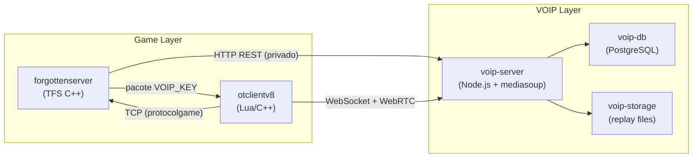
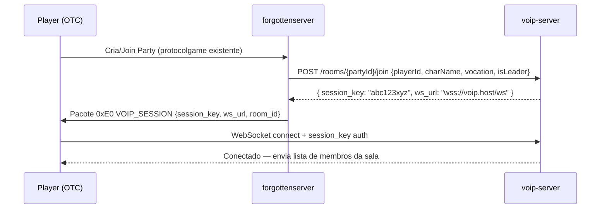
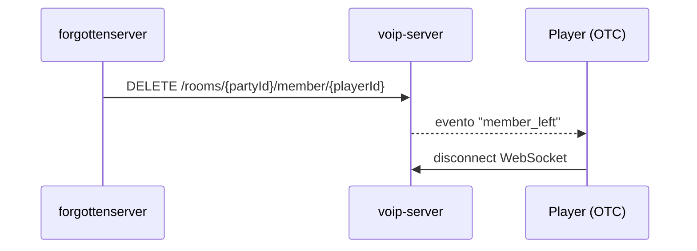

# VoIP In-Game Module — Plano de Implementação

## Visão Geral

Feature de voice chat baseada em **party**, onde o servidor do jogo age apenas como **autenticador e coordenador**. Toda a carga de voz transita diretamente entre os clientes e um **servidor VOIP dedicado** (processo separado), preservando a performance do servidor de jogo.



---

## ⚠ Decisões de Design Importantes

> [!IMPORTANT]
> **Stack VOIP**: Recomendado **Node.js + mediasoup v3** (SFU — Selective Forwarding Unit). Alternativas como Livekit (Go) ou Janus (C) também são viáveis. A escolha afeta como o server de jogo faz as chamadas REST. O plano abaixo assume mediasoup.

> [!IMPORTANT]
> **Comunicação Game Server → VOIP Server**: Via **HTTP REST interno** (não exposto à internet). O TFS chama endpoints do VOIP server ao criar/remover salas e ao mudar privilégios. Isso mantém o VOIP completamente independente do jogo.

> [!WARNING]
> **OTClientV8 não suporta WebRTC nativamente**. O módulo de voz no cliente precisará de uma das seguintes abordagens: **(A)** Criar um módulo C++ nativo embutido no OTC que use libwebrtc ou um SDK leve; **(B)** Rodar um processo helper local (ex: Electron ou app nativo mínimo) que o OTC controla via socket local; **(C)** Usar um SDK simples de áudio via UDP (ex: Opus + UDP custom) implementado diretamente em C++ no OTC. **Recomendamos a opção C** por simplicidade e controle total.

> [!NOTE]
> **Instant Replay** é gravado no VOIP server em memória circular de 90s por sala. Ao acionar o replay, o servidor persiste o segmento no storage e o cliente faz download via HTTP direto do VOIP server, sem passar pelo jogo.

---

## Arquitetura Detalhada

### Fluxo de criação de sala (Party CREATE / JOIN)



### Fluxo de saída / disband



---

## Componentes e Arquivos

---

### 1. VOIP Server (`voip-server/`) — **NOVO REPOSITÓRIO**

Serviço independente em **Node.js + mediasoup v3 + PostgreSQL**.

#### Estrutura de diretórios

```
voip-server/
├── src/
│   ├── server.ts          # Express HTTP + WebSocket server
│   ├── roomManager.ts     # Gerencia salas, membros, permissões
│   ├── replayManager.ts   # Buffer circular 90s + persistência
│   ├── authMiddleware.ts  # Valida session_key gerada pelo TFS
│   ├── dbClient.ts        # PostgreSQL connection pool
│   └── config.ts          # Portas, segredos, TTLs
├── migrations/
│   └── 001_initial.sql    # Tabelas: sessions, reports, replays
├── package.json
└── Dockerfile
```

#### Endpoints REST (acesso interno do game server)

| Método | Rota | Descrição |
|--------|------|-----------|
| `POST` | `/rooms/:partyId/join` | Cria sala se não existir + gera session_key para jogador |
| `DELETE` | `/rooms/:partyId/member/:playerId` | Remove membro da sala |
| `DELETE` | `/rooms/:partyId` | Dissolve a sala inteira |
| `PATCH` | `/rooms/:partyId/leader` | Transfere privilégios de líder |
| `PATCH` | `/rooms/:partyId/mute` | Muta membro para todos (ação do líder) |

#### WebSocket (acesso dos clientes OTC)

| Evento Client → Server | Descrição |
|------------------------|-----------|
| `auth { session_key }` | Autentica conexão |
| `produce { kind, rtpParameters }` | Inicia transmissão de áudio |
| `consume { producerId }` | Recebe áudio de outro membro |
| `mute_self` | Muta microfone localmente |
| `instant_replay` | Solicita gravação dos últimos 90s |
| `report { targetPlayerId }` | Gera replay + salva no DB |
| `volume_member { targetId, volume }` | Controle de volume local |

#### Banco de dados (PostgreSQL)

```sql
-- Sessions ativas
CREATE TABLE voip_sessions (
    session_key VARCHAR(64) PRIMARY KEY,
    player_id   INTEGER NOT NULL,
    char_name   VARCHAR(50),
    vocation    SMALLINT,
    room_id     VARCHAR(50),
    is_leader   BOOLEAN DEFAULT FALSE,
    created_at  TIMESTAMP DEFAULT NOW(),
    expires_at  TIMESTAMP  -- TTL: 24h
);

-- Reports / Replays
CREATE TABLE voip_reports (
    id           SERIAL PRIMARY KEY,
    room_id      VARCHAR(50),
    reporter_id  INTEGER,
    target_id    INTEGER,
    replay_file  TEXT,         -- caminho no storage
    session_data JSONB,        -- snapshot da sala no momento
    created_at   TIMESTAMP DEFAULT NOW(),
    expires_at   TIMESTAMP DEFAULT NOW() + INTERVAL '15 days'
);
```

---

### 2. forgottenserver — Integração C++ (modificações no TFS)

#### [MODIFY] `src/party.cpp` e `src/party.h`

- Em `joinParty()`: chamar `VoipManager::addMember(party, player)`
- Em `leaveParty()`: chamar `VoipManager::removeMember(party, player)`
- Em `passPartyLeadership()`: chamar `VoipManager::updateLeader(party, newLeader)`
- Em `disband()`: chamar `VoipManager::destroyRoom(party)`

#### [NEW] `src/voipmanager.h` / `src/voipmanager.cpp`

Responsabilidades:
- Gerar `session_key` aleatório (128-bit hex via `tools.h`)
- Fazer chamadas HTTP REST ao VOIP server (usando **cpp-httplib** ou **Boost.Beast**, já presente no TFS via Boost)
- Cache em memória dos `session_key` ativos por `partyId`

```cpp
class VoipManager {
public:
    static VoipManager& getInstance();
    
    // Chamado pelo Party ao criar/entrar na sala
    void addMember(Party* party, Player* player);
    
    // Chamado pelo Party ao sair/disbanding
    void removeMember(Party* party, Player* player);
    
    // Transferência de liderança
    void updateLeader(Party* party, Player* newLeader);
    
    // Diasband completo
    void destroyRoom(Party* party);

private:
    std::string generateSessionKey();      // crypto random 128-bit hex
    bool postToVoipServer(const std::string& path, const nlohmann::json& body);
    
    std::string voipServerUrl;             // config.lua: voipServerUrl
    std::string voipServerSecret;          // config.lua: voipServerSecret (HMAC)
};
```

#### [MODIFY] `src/protocolgame.cpp` e `src/protocolgame.h`

- Adicionar método `sendVoipSession(const VoipSession& session)` que envia ao cliente o pacote `0xE0`:

```
0xE0  [1 byte]  — opcode VOIP_SESSION
room_id         [string pascal]
session_key     [string pascal]  — 64 hex chars
ws_url          [string pascal]  — "wss://voip.seuhost.com/ws"
```

#### [MODIFY] `src/configmanager.cpp` e `src/configmanager.h`

- Adicionar configurações:
  - `VOIP_SERVER_URL` — URL interna do voip-server
  - `VOIP_SERVER_SECRET` — segredo HMAC para autenticação server-to-server

#### [MODIFY] `config.lua`

```lua
-- VoIP
voipServerUrl = "http://127.0.0.1:3001"
voipServerSecret = "SEU_SECRET_AQUI"
```

---

### 3. OTClientV8 — Módulo `game_voip` (Lua + C++ nativo)

#### [NEW] `modules/game_voip/` — Módulo Lua (UI + coordenação)

```
modules/game_voip/
├── game_voip.otmod
├── game_voip.lua        # lógica principal, recebe pacote 0xE0
├── voip_window.otui     # janela principal da chamada
└── voip_member.otui     # widget de cada membro na lista
```

#### [MODIFY] `modules/game_protocol/` — Recepção do pacote 0xE0

Adicionar parsing do pacote VOIP no protocolo cliente:

```lua
-- game_protocol/protocolgame.lua (ou arquivo equivalente)
local function parseVoipSession(msg)
    local session = {
        roomId     = msg:getString(),
        sessionKey = msg:getString(),
        wsUrl      = msg:getString(),
    }
    modules.game_voip.onVoipSession(session)
end
```

#### Layout da Janela de VOIP (`voip_window.otui`)

```
┌─────────────────────────────────┐
│  🎙 Party Voice Chat     [_][X] │
├─────────────────────────────────┤
│ [👑 LeaderName  EK  ●───]  [🔇]│ ← líder (coroa), vocation icon, qualidade
│ [    Member2   RP  ●──]   [🔕] │
│ [    Member3   MS  ●]     [🔕] │
├─────────────────────────────────┤
│ [🎙 Mute/Unmute] [⏺ Replay] [⚙]│
└─────────────────────────────────┘
```

**Indicadores por membro:**
- Ícone de vocação (EK/RP/MS/ED ou equivalente do servidor)
- Barra de qualidade de conexão: ●●● (verde/amarelo/vermelho)
- Animação de "falando" (onda de áudio pulsando)
- Botões contextuais:
  - **Todos:** mute para si, controle de volume (slider), reportar
  - **Líder sobre membros:** mute para todos

#### Comunicação de Áudio (C++ nativo no OTClientV8)

> [!IMPORTANT]
> Implementar em C++ dentro do OTClientV8 um módulo de áudio usando **PortAudio + libopus + UDP** direto ao VOIP server. O VOIP server atuará como um mixer/relay leve via UDP em vez de WebRTC completo, simplificando o cliente.

Alternativa mais simples: usar um **WebSocket binário** para enviar frames Opus comprimidos. O VOIP server faz relay dos frames para os demais membros da sala.

**Arquivos novos em OTClientV8 (C++):**
- `src/client/voipclient.h` / `voipclient.cpp` — gerencia conexão WebSocket, captura de microfone e playback
- Expõe funções Lua:
  - `g_voip.connect(wsUrl, sessionKey)`
  - `g_voip.disconnect()`
  - `g_voip.setMuted(bool)`
  - `g_voip.setMemberVolume(playerId, float)`
  - `g_voip.requestInstantReplay()`
  - `g_voip.reportMember(playerId)`

---

## Fases de Implementação

| Fase | O que entregar | Estimativa |
|------|---------------|------------|
| **Fase 1** | VOIP Server esqueleto (HTTP REST + WS auth + salas) | 1-2 semanas |
| **Fase 2** | TFS: VoipManager + pacote 0xE0 + integração party | 1 semana |
| **Fase 3** | OTClientV8: parsing 0xE0 + módulo Lua game_voip (sem áudio real, apenas UI) | 1 semana |
| **Fase 4** | OTClientV8: C++ voipclient (áudio real com Opus + WS binário) | 2-3 semanas |
| **Fase 5** | Instant Replay + Reports + expiração 15 dias | 1 semana |
| **Fase 6** | Polimento UI, indicadores de fala, qualidade de conexão | 1 semana |
| **Total** | | **~7–9 semanas** |

---

## Plano de Verificação

### Fase 1 — VOIP Server
- Testes unitários Node.js (Jest): `authMiddleware`, `roomManager`, `replayManager`
- Testar endpoints REST com curl:
  ```bash
  curl -X POST http://localhost:3001/rooms/1/join \
    -H "X-Secret: SEU_SECRET" \
    -d '{"playerId":1,"charName":"Teste","vocation":1,"isLeader":true}'
  ```
- Conectar dois clientes WebSocket de teste e verificar relay de mensagens

### Fase 2 — TFS Integration
- Compilar TFS (`cmake --build .`) sem erros
- Iniciar servidor local, criar party com dois personagens e verificar log do VOIP server recebendo os POST

### Fase 3 — Parser OTC
- Enviar pacote `0xE0` manually via ferramenta de debug do OTC e verificar se `game_voip.onVoipSession()` é chamado

### Fase 4 — Áudio
- Teste entre dois clientes locais: criar party, verificar que áudio flui em ambas as direções
- Medir latência: < 150ms end-to-end (target)

### Fase 5 — Replay
- Acionar botão de Instant Replay, verificar arquivo gerado no VOIP server storage
- Verificar que o arquivo é removido após 15 dias (cron job)

### Teste Manual Integrado
1. Compilar TFS e iniciar `tfs.exe`
2. Iniciar `voip-server` (`npm run start`)
3. Abrir dois clientes OTC, logar com dois personagens
4. Personagem A convida Personagem B para party
5. Verificar: janela VOIP abre em ambos os clientes com os membros listados
6. Falar no microfone do Personagem A → verificar animação de "falando" em ambos
7. Líder muta Personagem B para todos → verificar que B não é ouvido
8. Acionar Instant Replay → verificar download do arquivo no cliente
9. Personagem B sai da party → verificar que VOIP desconecta em B
10. Party é disbandada → sala no VOIP server é destruída
