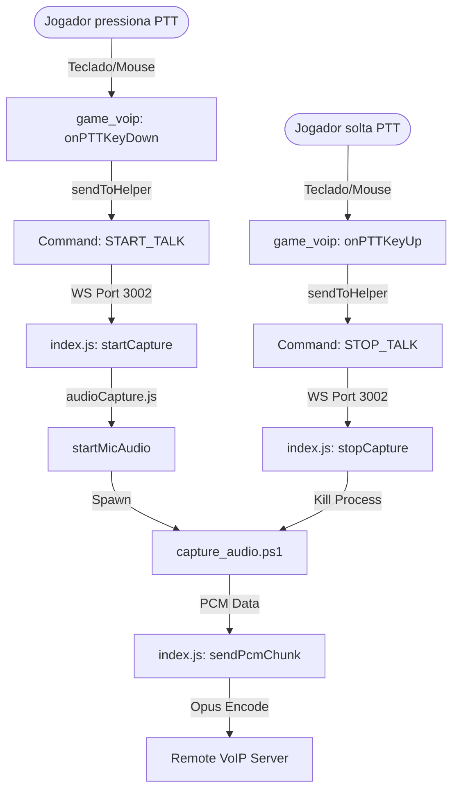
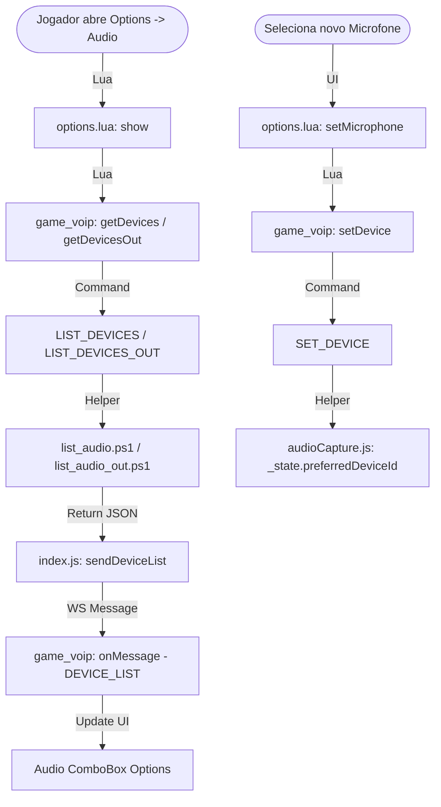
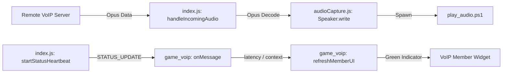
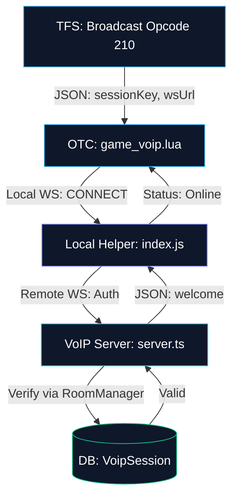

# Mapa de Funções: Voice Helper

Este documento descreve as funções do módulo `voip-helper` (Node.js) e como o OTClient interage com elas através do módulo Lua `game_voip`.

## 1. Funções do Helper (Node.js)

O `voip-helper` é um servidor WebSocket local (porta 3002) que gerencia a captura, codificação e reprodução de áudio.

### Core (audioCapture.js)
| Função | Descrição |
| :--- | :--- |
| `startMicAudio` | Inicia um processo PowerShell (`capture_audio.ps1`) para capturar áudio do microfone. |
| `startPlayback` | Inicia um processo PowerShell (`play_audio.ps1`) para reproduzir áudio recebido. |
| `listAudioDevices` | Executa `list_audio.ps1` para listar microfones disponíveis no sistema. |
| `listAudioOutputDevices` | Executa `list_audio_out.ps1` para listar saídas de áudio (speakers). |
| `sendPcmChunk` | Recebe áudio RAW (PCM), comprime usando **Opus** e envia para o Servidor VoIP principal. |
| `calculateVolume` | Calcula o nível de volume (RMS) do áudio capturado para o *Noise Gate*. |

### Servidor (index.js)
| Função | Descrição |
| :--- | :--- |
| `connectToMainVoip` | Abre uma conexão WebSocket com o servidor VoIP remoto (Node.js/TS). |
| `handleIncomingAudio` | Recebe áudio do servidor remoto, decodifica (Opus -> PCM) e envia para o Speaker. |
| `startStatusHeartbeat` | Envia atualizações de status (latência, nível de voz) para o OTClient a cada 200ms. |

---

## 2. Comandos Aceitos (JSON via WebSocket)

O Helper processa os seguintes comandos enviados pelo OTClient:

| Comando | Função Disparada | Parâmetros |
| :--- | :--- | :--- |
| `CONNECT` | `connectToMainVoip` | `wsUrl`, `sessionKey` |
| `START_TALK` | `startCapture` | - |
| `STOP_TALK` | `stopCapture` | - |
| `LIST_DEVICES` | `listAudioDevices` | - |
| `SET_DEVICE` | `preferredDeviceId` | `deviceId` |
| `LIST_DEVICES_OUT` | `listAudioOutputDevices` | - |
| `SET_DEVICE_OUT` | `preferredSpeakerId` | `deviceId` |
| `SET_SENSITIVITY` | `sensitivity` | `value` (0-100) |
| `TEST_START` | `startAudioTest` | - |
| `TEST_STOP` | `stopAudioTest` | - |

---

## 3. Fluxogramas de Interação

### Fluxo A: Transmissão de Voz (Push-to-Talk)
Este fluxo ocorre quando o jogador pressiona o botão configurado para falar.

### Fluxo B: Configuração de Dispositivos (Interface de Opções)
Este fluxo ocorre quando o jogador abre as opções de áudio ou altera o dispositivo.

### Fluxo C: Recepção de Áudio e Status
Fluxo contínuo enquanto conectado a uma Party.

### Fluxo D: Convite e Persistência de Sessão
Este fluxo detalha como o TFS sincroniza as informações da party com o VoIP Server e o Banco de Dados (Prisma). Note que o convite inicial **não** gera persistência no VoIP Server; esta só ocorre quando o jogador aceita entrar na party.

```mermaid
sequenceDiagram
    autonumber
    participant P1 as Player A (Líder)
    participant TFS as TFS (C++)
    participant VS as VoIP Server (Node)
    participant DB as Database (Prisma)
    participant P2 as Player B (Convidado)

    P1->>TFS: Convida Player B
    Note over TFS: Party::invitePlayer<br/>(Trigger: broadcastPartySnapshot)
    
    rect rgb(30, 41, 59)
    Note over TFS, DB: Sincronização Antecipada (HTTP POST)
    TFS->>VS: POST /rooms/party-P1/join (Líder e B)
    VS->>VS: roomManager.createOrJoin()
    VS->>DB: prisma.voipRoom.upsert
    VS->>DB: prisma.voipSession.upsert (Líder e B)
    VS-->>TFS: 200 OK (sessionKeys)
    end

    TFS->>P1: Extended Opcode 210 (Metadata - Líder Conectado)
    TFS->>P2: Envia Convite (Janela de Convite)
    
    Note over P2, TFS: O Player B já tem sessão no DB, mas ainda não recebeu o Opcode.

    P2->>TFS: Aceita Convite
    TFS->>TFS: Party::joinParty(P2)
    TFS->>TFS: VoipManager::broadcastPartySnapshot
    
    TFS->>P1: Extended Opcode 210 (Update)
    TFS->>P2: Extended Opcode 210 (Metadata - B Conectado)
```

### Fluxo E: Ponte de Conexão OTC -> Helper -> Remote
Como o cliente estabelece o canal de áudio final através do Helper local.

