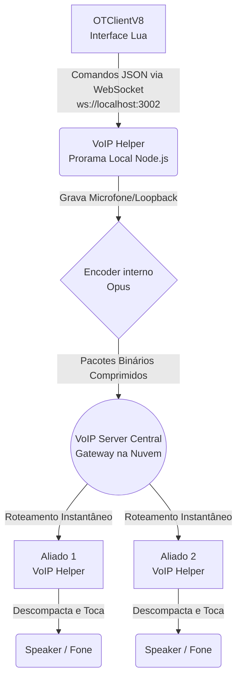
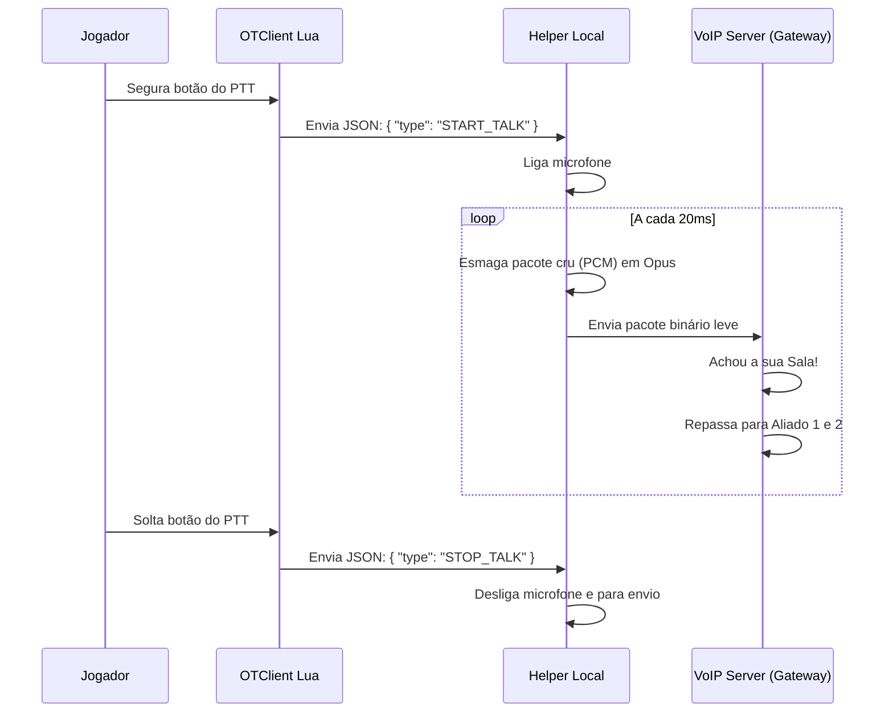

# 🎙️ VoIP Helper

Processo auxiliar Node.js que roda em segundo plano junto ao **OTClientV8**. Ele gerencia captura de áudio, compressão Opus e comunicação com o **VoIP Server** central — já que o OTClient não suporta acesso nativo a hardware de áudio via C++.

---

## 📋 Status Atual do Projeto (Checklist)

### ✅ O que já foi feito
- [x] **Captura de Áudio Local:** Implementada no `voip-helper` usando `node-record-lpcm16` (para microfone) e `naudiodon` (para mixagem estéreo/loopback do sistema).
- [x] **Compressão Opus:** O `voip-helper` utiliza `opusscript` para codificar o áudio raw (PCM) em pacotes leves antes do envio, e decodificar ao receber.
- [x] **Reprodução de Áudio:** O módulo `speaker` recebe os pacotes de outros jogadores e os reproduz nativamente no SO do jogador.
- [x] **Integração OTClient ↔ VoIP Helper:** A interface em Lua (`game_voip.lua`) já se conecta com sucesso via WebSocket (`ws://localhost:3002`) para enviar comandos como `START_TALK`, `STOP_TALK`, `CONNECT`, e `SET_CAPTURE_MODE`.
- [x] **Comunicação com o VoIP Server Principal:** O Helper abre uma segunda conexão com o servidor principal em Node (`server.ts`) em `ws://localhost:3001` (ou outro IP) para enviar e receber o fluxo binário de áudio.
- [x] **Controle Visual (Interface Gráfica):** O cliente possui botão de mute, indicador de quem está falando ("voiceIndicator" verde) e uma lista com a vida e mana dos membros da party.
- [x] **Servidor de VoIP (Gateway):** Construído com Node/Express/WS, ele já recebe conexões WebSocket do Helper, autentica via "sessionKey" gerado pelo TFS, e faz roteamento dos pacotes Opus binários de volta para os usuários da mesma sala.

### ⏳ O que ainda falta fazer (Next Steps)
- [ ] **Seleção de Dispositivos na Interface Gráfica:** A interface Lua ainda não tem um combobox para listar e escolher o dispositivo de entrada (Microfone A, Microfone B). O helper já suporta o envio e recebimento dos comandos `LIST_DEVICES` e `SET_DEVICE`, mas falta plugar isso visualmente na UI da aba VoIP.
- [ ] **Seleção de Saída de Áudio (`speaker`):** Atualmente o áudio descompactado recebido toca automaticamente no dispositivo padrão de reprodução do sistema (limitação padrão do pacote `speaker`). Seria ideal permitir mudar a saída para fones específicos caso o usuário queira separar o som do jogo do som do VoIP.
- [ ] **Controle de Volume e Sensibilidade:** Falta na UI os sliders de "Volume do Microfone", "Volume de Saída" (para escutar mais baixo) e "Sensibilidade/Gate de Ativação do Microfone" (útil se no futuro for adicionada a opção *Open Mic/Voice Activity*, dispensando o Push-To-Talk).
- [ ] **Autoinicialização Automática do Helper:** Garantir que o processo `voip-helper` suba automaticamente em plano de fundo de forma invisível/transparente para o usuário no instante que ele abrir o cliente do jogo. No futuro isso pode ser feito compilando um `.exe` e disparando-o no C++ do OTClient ou via script do SO.
- [ ] **Áudio Espacial e Distanciamento (Opcional):** Hoje o áudio chega com o mesmo volume não importa quão longe o jogador esteja na tela. A lógica de atenuar o volume de acordo com a distância (em sqms) pode ser interessante para roleplay.

---

## Arquitetura

```
┌────────────────────────────────────────────────────────────────┐
│                        OTClientV8 (Lua)                        │
│          Envia comandos JSON via WebSocket (porta 3002)        │
└────────────────────┬───────────────────────────────────────────┘
                     │ ws://localhost:3002
                     ▼
┌────────────────────────────────────────────────────────────────┐
│                      voip-helper (index.js)                    │
│                                                                │
│  ┌─────────────────────────────────────────────────────────┐   │
│  │              src/audioCapture.js (lógica pura)          │   │
│  │                                                         │   │
│  │  handleClientCommand() → setCaptureMode()               │   │
│  │  startSystemAudio()    → detectLoopbackDevice()         │   │
│  │  sendPcmChunk()        → opus.encode() → ws.send()      │   │
│  │  listAudioDevices()    → naudiodon.getDevices()         │   │
│  └─────────────────────────────────────────────────────────┘   │
│                                                                │
│  Captura Microfone: node-record-lpcm16                         │
│  Captura Sistema:   naudiodon (WASAPI Loopback)                │
│  Compressão:        opusscript (Opus @ 48kHz mono)             │
│  Reprodução:        speaker                                     │
└────────────────────┬───────────────────────────────────────────┘
                     │ ws://voip-server:3001  (binário Opus)
                     ▼
┌────────────────────────────────────────────────────────────────┐
│                     VoIP Server (Node.js)                      │
│              Retransmite audio para outros jogadores           │
└────────────────────────────────────────────────────────────────┘
```

---

## Mapa de Funções

### `src/audioCapture.js` — Módulo principal (exportado)

| Função | Descrição | Parâmetros | Retorno |
|---|---|---|---|
| `setCaptureMode(mode)` | Define a fonte de captura | `'mic'` \| `'system'` | `boolean` (true se válido) |
| `detectLoopbackDevice()` | Auto-detecta dispositivo loopback via naudiodon | — | `number` (device ID ou -1) |
| `listAudioDevices()` | Retorna dispositivos de entrada disponíveis | — | `Array<Device>` |
| `sendPcmChunk(chunk, ws, opus, wsOpen)` | Acumula PCM e envia frames Opus ao VoIP Server | Buffer, WebSocket, OpusScript, WS_OPEN | `number` (frames enviados) |
| `startSystemAudio(onChunk, onError)` | Inicia captura de áudio do sistema (WASAPI loopback) | callbacks | `AudioIO \| null` |
| `handleClientCommand(data, handlers)` | Processa comando JSON do OTClient | `{type, ...}`, handlers | `string \| null` (tipo do cmd) |
| `_resetState()` | Reseta estado interno (uso em testes) | — | `void` |
| `_getState()` | Retorna estado interno mutável (uso em testes) | — | `object` |

### `index.js` — Entrypoint

| Função | Descrição |
|---|---|
| `startCapture()` | Dispatcher: inicia mic ou sistema conforme `captureMode` |
| `stopCapture()` | Para mic + sistema e reseta estado `isTalking` |
| `startMic()` | Inicia gravação de microfone via `node-record-lpcm16` |
| `stopMic()` | Para o stream de microfone |
| `connectToMainVoip(url, key)` | Abre conexão WebSocket ao VoIP Server e autentica |
| `sendDeviceList()` | Busca dispositivos e envia `DEVICE_LIST` ao OTClient |
| `handleIncomingAudio(buf)` | Decodifica Opus recebido e escreve no `Speaker` |

---

## Comandos — OTClient → VoIP Helper

Enviados como JSON via WebSocket em `ws://localhost:3002`.

| Comando | Parâmetros | Descrição |
|---|---|---|
| `CONNECT` | `wsUrl`, `sessionKey` | Conecta ao VoIP Server com a chave de sessão |
| `SET_CAPTURE_MODE` | `mode: 'mic' \| 'system'` | Troca a fonte de áudio |
| `START_TALK` | — | Inicia captura e envio de áudio |
| `STOP_TALK` | — | Para captura de áudio |
| `LIST_DEVICES` | — | Solicita lista de dispositivos (resposta: `DEVICE_LIST`) |
| `SET_DEVICE` | `deviceId: number` | Força um dispositivo de áudio específico |

## Eventos — VoIP Helper → OTClient

| Evento | Payload | Descrição |
|---|---|---|3
| `DEVICE_LIST` | `devices: Device[]` | Lista de dispositivos de entrada disponíveis |
| `welcome` | `charName` | Confirmação de autenticação no VoIP Server |
| `member_joined` | `charName` | Outro jogador entrou na sala de voz |

---

## Exemplo de uso em Lua (OTClient)

```lua
local helper = WebSocket.new("ws://localhost:3002")

-- Usar áudio do sistema (loopback) em vez de microfone
helper:send(json.encode({ type = "SET_CAPTURE_MODE", mode = "system" }))

-- Conectar ao VoIP Server com a sessionKey recebida do TFS
helper:send(json.encode({
    type       = "CONNECT",
    wsUrl      = "ws://voip-server:3001",
    sessionKey = mySessionKey
}))

-- Push-to-talk
function onPushToTalkDown()
    helper:send(json.encode({ type = "START_TALK" }))
end

function onPushToTalkUp()
    helper:send(json.encode({ type = "STOP_TALK" }))
end
```

---

## Pipeline de Áudio

```
[Microfone / Loopback]
        │
        │  PCM bruto (16-bit, 48kHz, mono)
        ▼
  Buffer acumulador
        │  (aguarda 960 samples = 20ms)
        ▼
  opus.encode(frame, 960)
        │  Opus comprimido (~40 bytes/frame)
        ▼
  ws.send(binary)  ──►  VoIP Server  ──►  outros jogadores
```

---

## 🧠 Conceitos Básicos Utilizados no Projeto

Para facilitar o entendimento geral, aqui estão as explicações sobre os conceitos fundamentais sobre os quais o VoIP foi construído, integrando-se à arquitetura já demostrada acima:

1. **WebSocket (WS):** É a tecnologia que permite uma comunicação "aberta" constante, bidirecional e de tempo real. Diferente do HTTP normal (onde você pede uma página web, espera, e a conexão fecha logo em seguida), o WebSocket cria um tubo direto que fica 100% do tempo aberto. No nosso caso, temos 2 "tubos":
   - *Tubo Local:* `OTClient Lua ↔ voip-helper` (Troca apenas de comandos curtos em formato JSON, ex: "Começa a gravar agora", "Apertei o botão de mutar"). É local e não tem latência.
   - *Tubo Externo (Rede):* `voip-helper ↔ VoIP Server Central` (Troca real e pesada do fluxo de áudio comprimido entre os jogadores pela internet).

2. **Push-To-Talk (PTT):** Significa "Aperte para Falar". O client em Lua no jogo detecta instantaneamente quando a tecla/botão do mouse de PTT (configurada nas hotkeys) é pressionada e envia o evento `START_TALK`. Quando solta, envia `STOP_TALK`. Isso economiza absurdamente a banda do servidor (e a CPU), pois o áudio só viaja na rede e engaja a placa de som quando há fala manifestada intencionalmente.

3. **Opus (Codec de Áudio):** Imagine o PCM bruto como um arquivo de imagem ".BMP" gigante e puro, e o Opus como um JPG moderno extremamente otimizado, feito para voz, não para imagem. O Opus foi projetado do zero para rodar nativamente em VoIPs na internet. Ele tolera instabilidade de pacotes perdidos na rede, possuindo altíssima fidelidade e uma latência baixíssima.

4. **Loopback / Stereo Mix (Audio do Sistema):** Há momentos (em testes ou usos futuros) onde o usuário não quer transmitir seu microfone, mas sim transmitir exatamente as mesmas coisas que **"o computador dele está tocando no fundo"** (os sons do próprio jogo, o youtube dele etc). Essa placa ou dispositivo virtual capturador é chamado estéreo mix/loopback. O módulo `naudiodon` intercepta esse som interno e trata como se fosse uma pessoa falando num microfone.

5. **VoIP Server Router (Gateway de Distribuição):** No backend (servidor central), o nosso servidor não precisa "ouvir" e entender o seu áudio, ele também não processa nem decodifica ele. Ele apenas atua como um carteiro estúpido porém muito rápido num centro de distribuição expressa. Quando o jogador A fala, o servidor pega aquele pacote sonoro Opus binário às cegas, analisa de quem é a party dele, bota numa laço e atira de volta instantaneamente ("for each") para as pontas B, C e D conectadas da mesma sala, garantindo que chegue nas orelhas deles.

---

## O que é PCM?

**PCM** (Pulse Code Modulation — Modulação por Código de Pulso) é o formato mais básico de áudio digital: uma sequência de números que descrevem a amplitude (volume) do som em intervalos regulares de tempo.

O microfone ou o loopback do sistema captura variações de pressão de ar e um conversor analógico-digital **"tira fotos" da amplitude do som milhares de vezes por segundo**. Cada "foto" é um número — e a sequência é o PCM.

```
Onda sonora analógica:       ~~~⌒⌒⌒~~~___~~~⌒⌒⌒~~~
                                    ↓ ADC
PCM (16-bit, simplificado):  [ 0, 12000, 24000, 28000, 12000, 0, -12000... ]
```

### Parâmetros do projeto

| Parâmetro | Valor | Significado |
|---|---|---|
| **Sample Rate** | `48.000 Hz` | 48.000 amostras por segundo |
| **Bit Depth** | `16-bit` | Cada amostra vai de `-32768` a `+32767` |
| **Canais** | `1` (mono) | Um único fluxo de áudio |

### Por que PCM não é enviado direto pela rede?

PCM bruto é **muito pesado** — 48.000 amostras × 2 bytes = **~96 KB/s**. Por isso usamos o encoder **Opus**, que comprime para ~4 KB/s mantendo qualidade de voz.

O `sendPcmChunk()` acumula chunks até ter **960 amostras (= 20ms)**, que é o frame mínimo aceito pelo Opus:

```
PCM bruto (~96 KB/s)  →  opus.encode(960 samples)  →  Opus (~4 KB/s) ✅
```

---

## 📦 Principais Bibliotecas Utilizadas (Dependências Core)

A escolha dessas bibliotecas no ecossistema Node.js foi fundamental, visto que a linguagem não possui suporte nativo para manipulação avançada de hardware de som em tempo real:

1. **`node-record-lpcm16` (Captura de Microfone):**
   É um wrapper ("empacotador") simples e leve que ativa os utilitários de gravação nativos do sistema operacional (como o SoX). Em vez de usar bibliotecas complexas pesadas em C++, ele inicia a gravação do microfone e repassa os bytes crus (PCM) para o nosso código Node de forma contínua em tempo real.

2. **`naudiodon` (Captura de Sistema / WASAPI Loopback):**
   É uma ponte (binding) direta em C++ para a biblioteca PortAudio. Ela é responsável por acessar funcionalidades restritas do sistema via WASAPI (**Windows Audio Session API**) que permitem o modo de "Loopback", o chamado *Stereo Mix*. Com ela, podemos capturar e gravar o que a própria placa de som está reproduzindo (como os barulhos do jogo) e mandar no lugar do microfone de forma nativa e sem necessidade de placas de som virtuais.

3. **`opusscript` (Compressão / Codec Opus):**
   Como capturamos muito áudio bruto, não é viável enviar 96 KB/s sem travar a rede do jogo. O `opusscript` contém o código oficial do algoritmo Opus (escrito originalmente em C++) compilado para WebAssembly. Ele engole pacotes PCM a cada 20ms (frame) e comprime absurdamente — mantendo a excelente fidelidade para a fala. Também usamos ele para fazer o inverso: decodificar os minúsculos pacotes recebidos dos aliados para a sua forma integral sonora.

4. **`speaker` (Reprodução):**
   Assim como o Node.js não sabe abrir o microfone nativamente, ele também não tem comandos para mandar som para as caixas de som/fone de ouvido. O módulo `speaker` é um adendo nativo (C/C++) que possibilita criar uma "caixa de saída de dados". À medida que desserializamos/descompactamos os arquivos usando o `opusscript`, passamos as frequências cruas pra esse pacote, e ele força sua placa de áudio padrão reproduzi-los quase que instantaneamente para você escutar.

| Pacote (Extra) | Uso |
|---|---|
| `ws` | WebSocket server (OTClient) e client (VoIP Server) |
| `jest` *(dev)* | Testes unitários para garantir que o fluxo e manipulação não falhem. |

---

## Instalação e execução

```bash
cd voip-helper

# Instalar dependências
npm install

# Rodar o helper
npm start

# Rodar os testes
npm test

# Testes com cobertura
npm run test:coverage
```

---

## Estrutura de arquivos

```
voip-helper/
├── index.js              # Entrypoint (WebSocket server + mic + speaker)
├── package.json
├── src/
│   └── audioCapture.js   # Lógica pura de captura e envio de áudio (testável)
└── __tests__/
    └── audioCapture.test.js  # 39 testes unitários Jest
```

---

## 📊 Fluxogramas de Operação

Para ajudar na visualização de como as peças se encaixam, aqui estão os diagramas do fluxo de dados:

### 1. Arquitetura Macro (Rede)
Este diagrama ilustra como o áudio sai do computador de um jogador comum e chega até os aliados da *party*:



### 2. Fluxo do Push-To-Talk (Linha do Tempo)
Como o sistema se comporta ao longo do tempo quando você decide falar:


