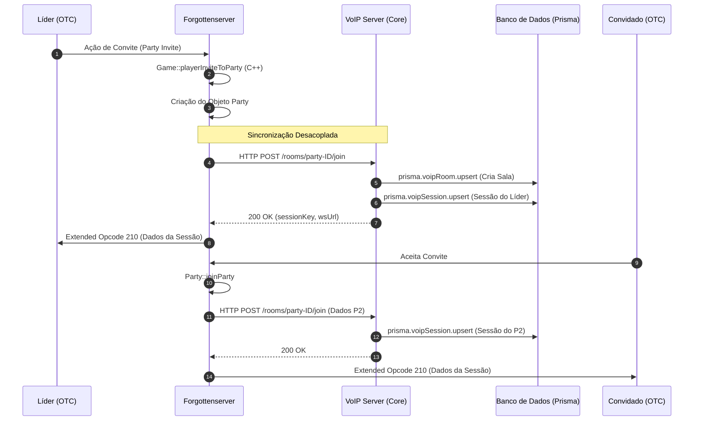

# Arquitetura e Mapeamento do Sistema VoIP

Este documento detalha o funcionamento desacoplado do sistema VoIP, composto por quatro módulos interdependentes: **OTClient**, **Voip-Helper**, **Voip-Server** e **Forgottenserver (TFS)**.

## 1. Visão Geral da Arquitetura
O sistema foi desenhado de forma modular para que o processamento de áudio e a persistência não sobrecarreguem o servidor de jogo (TFS).


### Os 4 Módulos
| Módulo | Papel Principal | Localização |
| :--- | :--- | :--- |
| **OTClient (OTC)** | Interface de usuário (Lua) e controle de lógica de interface. | Cliente |
| **Voip-Helper** | Ponte local para captura de áudio (PowerShell/Node) e bridge WebSocket. | Cliente (`otclientv8/voip-helper`) |
| **VoIP Server** | **Núcleo Central**. Gerencia conexões WS, persistência (Prisma) e relay de áudio. | Servidor Remoto (`voip-server`) |
| **Forgottenserver (TFS)** | Servidor de Jogo. Notifica o VoIP Server sobre eventos de Party para sincronia. | Servidor Remoto (`forgottenserver`) |

---

## 2. Fluxo de Convite e Persistência
A persistência ocorre no **VoIP Server** assim que o TFS notifica uma mudança na Party.



---

## 3. Fluxo de Conexão e Áudio
O **VoIP Server** é o responsável final por criar o túnel de áudio e autenticar as sessões.

```mermaid
graph TD
    A[OTC: game_voip.lua] -->|Opcode 210 via TFS| B(Recebe sessionKey)
    B -->|WS Connect: local| C[Voip-Helper: local bridge]
    C -->|WS Redirect: auth| D[VoIP Server: Central Hub]
    D -->|Validação Prisma| E[(SQLite: voipSession)]
    
    E -->|Success| D
    D -->|JSON: welcome| C
    C -->|Status: Online| A
    
    Note over C,D: O Helper captura áudio via PowerShell e envia Opus para o Server
    
    style D fill:#0f172a,stroke:#38bdf8,stroke-width:2px,color:#fff
    style C fill:#0f172a,stroke:#818cf8,color:#fff
    style E fill:#0f172a,stroke:#10b981,color:#fff
```

---

## 4. Detalhes de Persistência (voip-server/src/roomManager.ts)
Diferente do TFS, o VoIP Server persiste as salas e sessões de forma independente:

- **RoomManager.createOrJoin**: Chamada via REST API pelo TFS. Executa o `upsert` no banco de dados.
- **Prisma Schema**:
    - `VoipRoom`: Identifica a party e configurações globais (Mute).
    - `VoipSession`: Chave temporária associada ao jogador e à sala.
- **Desacoplamento**: Se o VoIP Server reiniciar, o TFS pode restabelecer as salas enviando novos snapshots das parties ativas.

---

> [!TIP]
> **Como salvar este documento:**
> Você pode salvar este conteúdo como arquivo `.md`. Para visualização premium fora do VS Code, recomendo usar o **Typora**, **Obsidian** ou o [Mermaid Live Editor](https://mermaid.live/) para exportar os fluxogramas em PNG/PDF de alta qualidade.
